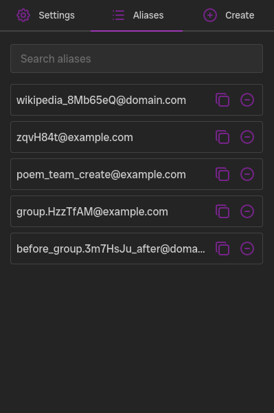
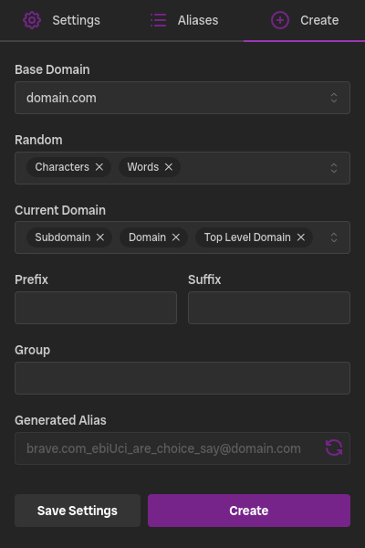

# Email Alias Generator Extension

An extension for use with a catch all email service / inbox. This provides a quick way to make email alias
addresses with flexibility of the generated alias while not being tied down to any specific platform or service.

The goal of this was to address the lack of feature filled extensions for catch all email alias generation like the 
ones for services such as [Simplelogin.io](https://simplelogin.io/) or [Addy.io](https://addy.io/). While there are 
many services that support catch all email address most if not any provide a means of easily creating / generating them.
I wanted something similar in ease of use equal to how password managers generate passwords but with even more flexible options.

## Screenshots

## Install

### Chrome / Chromium
[Download](https://chromewebstore.google.com/detail/email-alias-generator-ext/ibbpakdlegakppigeoichkmkoknjajan) from chrome webstore.

### Firefox
[Download](https://addons.mozilla.org/en-US/firefox/addon/email-alias-generator/) from mozilla addons.

### Manual
[Download](https://github.com/UnderscoreOfficial/Email-Alias-Generator-Extension/releases/latest) latest release from github.

- Chrome
    - Open browser extension page
    - Drag downloaded extension on the page
- Firefox
    - Open the downloaded file (firefox will confirm if you want to install this extension)

## Features
- Flexible settings to change how alias is generated / what is enabled
- Random character / word generation
- Get current website url
- Custom groups with auto fill
- Save generated aliases
- Dark / Light mode

## Important

This extension gets your current active page url when opened. This is only used for the current domain section when creating an alias and is only ever
stored in localstorage in your browser. If someone wants to verify this the current url is saved / accessed in these 3 files 
(src/popup.tsx, src/components/Create-Alias.tsx, src/utils/generatedAlias.ts). Due to the way extension permissions work there is no way for me to disable
this functionality without making a separate build to where your browser won't require this permision at all. 

Required permisions for each browser:
    - (chrome / chromium) Read your browsing history
    - (firefox) Access browser tabs

Saving created aliases, similar to the current active page url these are only ever saved in your browsers localstorage. Saving created aliases is optional
you are able to disable the alias page and thus the saving of aliases to localstorage. To do this go to the settings tab and toggle (Disable Alias Storing), 
this will disable the alias page, change the create page to copy only and force the create page as the default page.

## Build

1. Install Node.js
2. Install pnpm: `npm install -g pnpm`
3. Clone repo: `git clone https://github.com/UnderscoreOfficial/Email-Alias-Generator-Extension.git`
4. Run build cmd: `pnpm build` for firefox, `pnpm build:chrome` for chrome
5. Output is in the `build` folder `build/firefox-mv3-prod` or `build/chrome-mv3-prod`

- Firefox
    1. Go to `about:debugging`
    2. Click `This firefox`
    3. Click `Load Load Temporary Add-On...`
    4. Select the `manifest.json` from `build/firefox-mv3-prod` folder
    5. (This will only last until the next browser restart)
- Chrome
    1. Go to `Settings -> Extensions`
    2. Enable `Developer mode`
    3. Click `Load unpacked`
    4. Select the folder from `build/chrome-mv3-prod`
